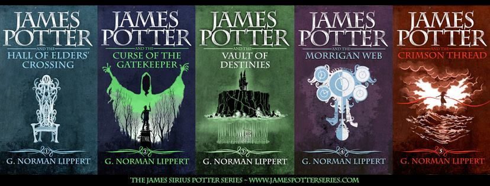

# James Potter 

Traduction française de la série James Potter de G. Norman Lipper par Iphégore 
Ossenoire (Hydralune). Il s'agit d'une fanfiction en 5 tomes. Ou en 5.5 tomes, 
car il existe un tome intermédiaire qui peut faire office de tome 2.5.

Vous pouvez soumettre des corrections des typos. Les corrections approuvées
seront automatiquement mises dans les ePub à jour de la page Releases.

**[Accio ePub ! Cliquez ici pour les fichiers](https://github.com/Iphegore/jamespotter/releases/tag/augoutdujour)**

Site officiel de la série : https://jamespotterbooks.com/

# Formats disponibles

Uniquement ePub, qui est compatible avec toutes les liseuses. Sans DRM.

# Derniers conseils

Amusez-vous bien ! C'est surtout fait pour ça, la littérature de l'imaginaire.

Achetez les livres de [G. Normann Lippert](http://www.georgenormanlippert.com/) 
pour le remercier de l'immense effort
de rédiger cette série. Ça vaut bien de sacrifier un Mc Do. Surtout le tome 2.5
qui n'est pas disponible en français, il vous donnera des infos utiles sur Miss
Morganstern. 

Achetez aussi [les miens](https://hydralune.com/categorie-produit/support/numeriquetri/), 
ils sont déjà en français :D 

Arvi !
Iphégore Ossenoire.

# Notes de traduction 

- Il peut y avoir des accords de proximité, c'est-à-dire des participes passés
accordés au féminin quand la grammaire traditionnelle utiliserait le masculin.

- En anglais, les deux termes Sorcerer et Wizard sont différents, mais Wizard
a été traduit par Sorcier dans la série d'origine, Sorcerer est donc devenu 
Elementaliste. C'est triste, mais on n'y peut pas grand-chose. Cela concerne
peu de personnages de toute façon.

- Le nom des maisons suit la règle des gentilés pour les majuscules et
minuscules.

- M., Mme, mais Miss. Parce que c'est plus joli. Voilà. Fait du Prince.

- Winkles & Augers est resté en anglais, ça sonnait mieux que les idées de
traduction que j'avais trouvées. 

J'ajouterai ici ce que j'ai oublié et qui pourrait être souligné par les 
correcteurs.

## Comment soumettre une correction ? 

1. Obtenir un compte GitHub
2. Cloner le dépôt (fork)
3. Trouver le fichier qui correspond au chapitre où vous voulez apporter un 
changement.
4. Éditer et sauvegarder (commit) le fichier 
5. Cliquer sur Pull Request et remplir le formulaire

